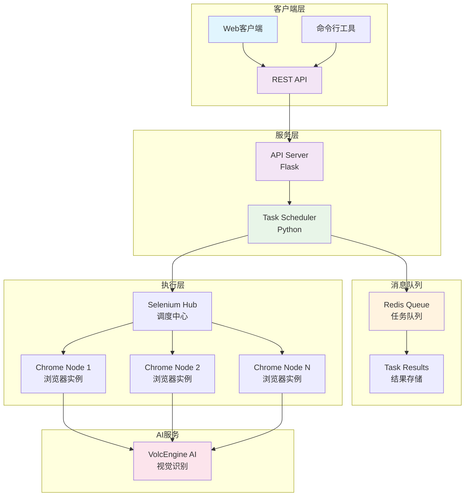

<div align="center">

# 🤖 智能验证码自动识别系统 (zyD)

*基于火山引擎AI和Selenium的智能验证码自动识别解决方案*

[](https://python.org)
[](https://docker.com)
[](LICENSE)
[](#)

[功能特性](#-功能特性) • [快速开始](#-快速开始) • [API文档](#-api接口) • [配置说明](#️-配置说明) • [故障排除](#-故障排除)

</div>

---

## 📖 项目简介

**zyD** 是一个现代化的智能验证码识别系统，采用先进的AI技术和分布式架构设计。系统集成了火山引擎豆包大模型的视觉识别能力，结合Selenium Grid的分布式浏览器自动化，为验证码识别提供高效、稳定的解决方案。

### 🎯 核心优势

- **🧠 AI驱动** - 基于火山引擎豆包大模型的先进视觉识别技术
- **⚡ 高性能** - 分布式架构支持高并发处理
- **🔧 易部署** - Docker容器化，一键启动
- **📊 可监控** - 完整的日志记录和实时状态跟踪

---

## 🌟 功能特性

<table>
<tr>
<td width="50%">

### 🤖 智能识别
- **AI驱动识别** - 集成火山引擎豆包大模型
- **多模态支持** - 文本和视觉模型组合
- **智能重试** - 指数退避重试机制
- **自适应优化** - 动态调整识别策略

</td>
<td width="50%">

### 🚀 分布式架构
- **Docker容器化** - 环境隔离，易于部署
- **Selenium Grid** - 多节点并发处理
- **Redis队列** - 异步任务调度管理
- **RESTful API** - 标准HTTP接口

</td>
</tr>
<tr>
<td width="50%">

### 📊 监控运维
- **实时监控** - 任务状态实时跟踪
- **完整日志** - 详细的操作记录
- **健康检查** - 系统状态自动检测
- **性能指标** - 关键指标监控

</td>
<td width="50%">

### ⚙️ 灵活配置
- **JSON配置** - 结构化配置管理
- **环境变量** - 支持容器化部署
- **热更新** - 无需重启的配置更新
- **多环境** - 开发/测试/生产环境支持

</td>
</tr>
</table>

---

## 🏗️ 系统架构


## 📋 环境要求
组件 版本要求 说明 Python 3.9+ 主要运行环境 Docker 20.10+ 容器化部署 Docker Compose 2.0+ 服务编排 内存 4GB+ 建议配置 磁盘 2GB+ 可用空间 火山引擎API 有效密钥 AI服务访问

## 🚀 快速开始
### 步骤 1: 获取项目
```
# 克隆项目
git clone <repository-url>
cd zyD
```
### 步骤 2: 配置环境
```
# 复制配置文件模板
cp src/config/config.example.json config/config.
json

# 编辑配置文件
vim config/config.json
```
```
{
  "ai": {
    "api_key": "your-volcengine-api-key",
    "vision_model": "doubao-1.5-vision-lite-250315"
  },
  "web": {
    "base_url": "https://target-site.com/captcha",
    "code_input_id": "captcha-input",
    "submit_button_selector": "#submit-btn"
  },
  "retry": {
    "max_attempts": 5,
    "backoff_factor": 2
  }
}
```
### 步骤 3: 启动服务
🐳 Docker部署（推荐）
```
# 启动所有服务
docker-compose up -d

# 查看服务状态
docker-compose ps

# 实时查看日志
docker-compose logs -f
``` 💻 本地开发
```
# 使用Conda环境（推荐）
conda env create -f environment.yml
conda activate captcha-solver

# 或使用pip
pip install -r requirements.txt

# 运行主程序
python main.py
```

### 步骤 4: 验证部署
```
# 健康检查
curl http://localhost:8000/health

# Selenium Grid控制台
open http://localhost:4444

# 提交测试任务
curl -X POST http://localhost:8000/submit_task \
  -H "Content-Type: application/json" \
  -d '{"url": "https://example.com/captcha"}'
```
## 🔧 使用方式
### 🎯 单次执行模式
适用于简单的一次性验证码识别任务：

```
# 直接运行验证码识别
python main.py
```
### 🌐 API服务模式
适用于需要集成到其他系统的场景：

```
# 启动API服务器
python -m src.api.server

# 启动任务调度器
python -m src.core.scheduler
```
## 📡 API接口
### 提交任务
POST /submit_task

```
curl -X POST http://localhost:8000/submit_task \
  -H "Content-Type: application/json" \
  -d '{
    "url": "https://target-site.com/captcha",
    "priority": "high",
    "timeout": 30
  }'
```
响应示例：

```
{
  "task_id": "task_123456789",
  "status": "submitted",
  "message": "Task submitted successfully"
}
```
### 查询任务状态
GET /task_status/{task_id}

```
curl http://localhost:8000/task_status/
task_123456789
```
响应示例：

```
{
  "task_id": "task_123456789",
  "status": "completed",
  "result": {
    "success": true,
    "captcha_code": "ABC123",
    "processing_time": 5.2
  }
}
```
### 健康检查
GET /health

```
curl http://localhost:8000/health
```
## ⚙️ 配置说明
### 📁 配置文件结构
```
config/
├── config.json              # 主配置文件
├── config.example.json      # 配置模板
docker-compose.yml           # Docker服务编排
environment.yml              # Conda环境配置
```
### 🔧 关键配置项
配置项 说明 默认值 示例 browser.headless 无头模式 true false ai.vision_model 视觉识别模型 doubao-1.5-vision-lite-250315 - retry.max_attempts 最大重试次数 5 3 web.success_check_timeout 成功检查超时(秒) 10 15 logging.level 日志级别 INFO DEBUG

## 📊 监控和日志
### 📋 日志查看
```
# Docker环境日志
docker-compose logs -f captcha-solver

# 本地环境日志
tail -f logs/app.log

# 错误日志
tail -f logs/error.log
```
### 📈 Redis队列监控
```
# 连接Redis
docker-compose exec redis redis-cli

# 查看队列长度
LLEN captcha_tasks

# 查看任务结果
HGETALL task_results

# 监控队列实时变化
MONITOR
```
### 📊 性能指标
- 任务处理速度 : 平均每个任务处理时间
- 成功率 : 验证码识别成功率
- 队列长度 : 待处理任务数量
- 系统资源 : CPU、内存使用情况
## 🔍 故障排除
### ❗ 常见问题
```
# 检查API密钥
echo $VOLCENGINE_API_KEY

# 测试API连接
curl -H "Authorization: Bearer $API_KEY" https://
ark.cn-beijing.volces.com/api/v3/chat/completions

# 调整识别提示词
vim config/config.json
```
```
# 检查Selenium Grid状态
curl http://localhost:4444/status

# 重启浏览器节点
docker-compose restart chrome

# 查看容器资源使用
docker stats
```
```
# 检查Redis连接
docker-compose exec redis redis-cli ping

# 重启调度器
docker-compose restart task-scheduler

# 清理异常任务
docker-compose exec redis redis-cli DEL 
captcha_tasks
```
### 🧹 清理命令
```
# 完全清理Docker环境
docker-compose down -v
docker system prune -f
docker volume prune -f

# 清理Redis数据
docker-compose exec redis redis-cli FLUSHDB

# 清理日志文件
rm -rf logs/*.log
```
## 🛠️ 开发指南
### 📁 项目结构
```
zyD/
├── 📁 src/                    # 源代码目录
│   ├── 📁 ai/                 # AI模型集成
│   │   └── volcengine_ai.py   # 火山引擎AI接口
│   ├── 📁 api/                # REST API服务
│   │   └── server.py          # Flask API服务器
│   ├── 📁 config/             # 配置管理
│   │   ├── config.py          # 配置类定义
│   │   └── config.example.json # 配置模板
│   ├── 📁 core/               # 核心功能
│   │   ├── browser_driver.py  # 浏览器驱动
│   │   └── scheduler.py       # 任务调度器
│   ├── 📁 utils/              # 工具函数
│   │   └── logger.py          # 日志工具
│   └── main.py                # 主入口文件
├── 📁 config/                 # 配置文件
├── 📁 data/                   # 数据目录
│   └── 📁 screenshots/        # 截图存储
├── 📁 logs/                   # 日志文件
├── 📁 docker/                 # Docker配置
├── docker-compose.yml         # 服务编排
├── requirements.txt           # Python依赖
├── environment.yml            # Conda环境
└── README.md                  # 项目文档
```
### 🔧 扩展开发 1. 添加新的AI模型
```
# src/ai/custom_ai.py
class CustomAI:
    def __init__(self, api_key: str):
        self.api_key = api_key
    
    def chat_completion(self, prompt: str, 
    image_data: bytes) -> str:
        # 实现自定义AI模型接口
        pass
``` 2. 自定义验证码处理逻辑
```
# src/core/custom_processor.py
class CustomCaptchaProcessor:
    def process(self, driver, ai_client):
        # 实现特定网站的验证码处理逻辑
        pass
``` 3. 扩展API接口
```
# src/api/server.py
@app.route('/custom_endpoint', methods=['POST'])
def custom_endpoint():
    # 实现自定义API接口
    pass
```
### 🧪 测试指南
```
# 运行单元测试
python -m pytest tests/

# 运行集成测试
python -m pytest tests/integration/

# 生成测试覆盖率报告
python -m pytest --cov=src tests/
```
## 📄 许可证
本项目采用 MIT 许可证 - 查看 LICENSE 文件了解详情。

## 🤝 贡献
我们欢迎所有形式的贡献！

### 🔄 贡献流程
1. Fork 本项目
2. 创建 特性分支 ( git checkout -b feature/AmazingFeature )
3. 提交 更改 ( git commit -m 'Add some AmazingFeature' )
4. 推送 到分支 ( git push origin feature/AmazingFeature )
5. 打开 Pull Request
### 📋 贡献指南
- 遵循现有的代码风格
- 添加适当的测试用例
- 更新相关文档
- 确保所有测试通过
## 📞 支持与联系
### 🆘 获取帮助

联系方式：

- 📧 邮件 : your-email@example.com
- 🐛 Bug报告 : GitHub Issues
- 💡 功能建议 : GitHub Discussions
- 📖 文档 : 项目Wiki
### ⚠️ 免责声明
本工具仅供学习和研究使用。使用时请确保遵守目标网站的使用条款和相关法律法规。

Made with ❤️ by the zyD Team

⭐ 如果这个项目对您有帮助，请给我们一个Star！ ⭐